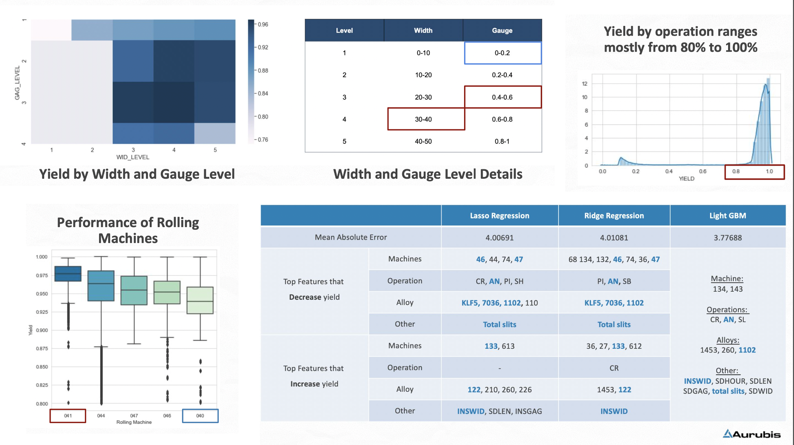
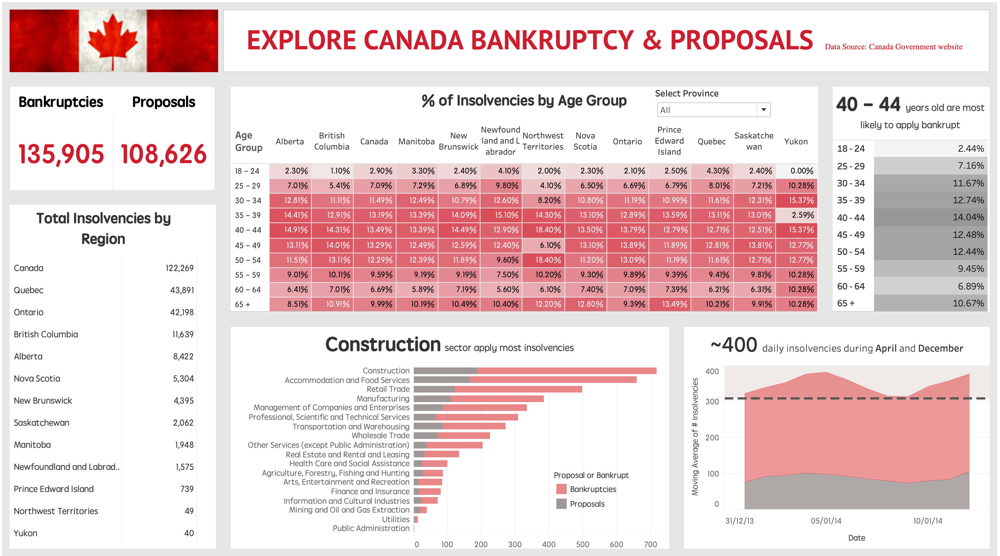
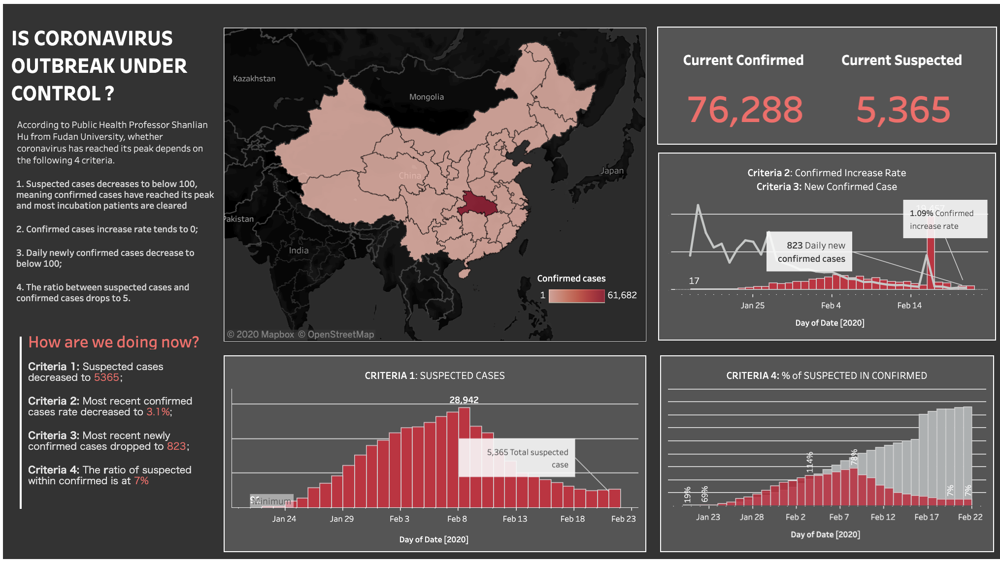
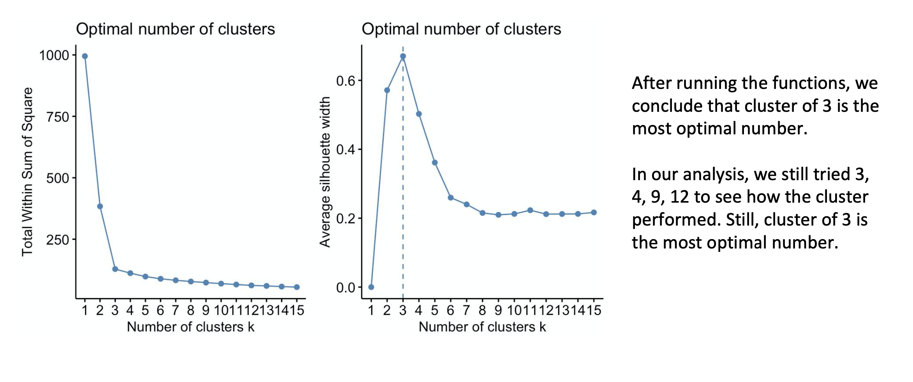
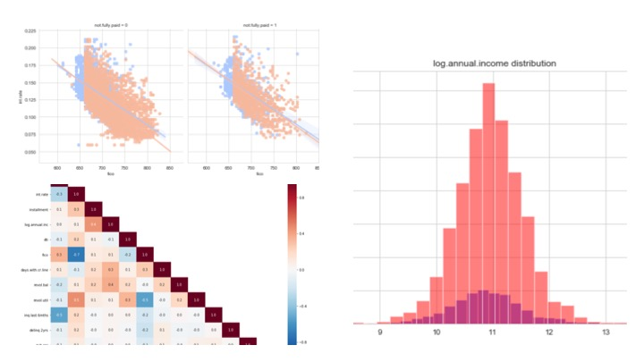
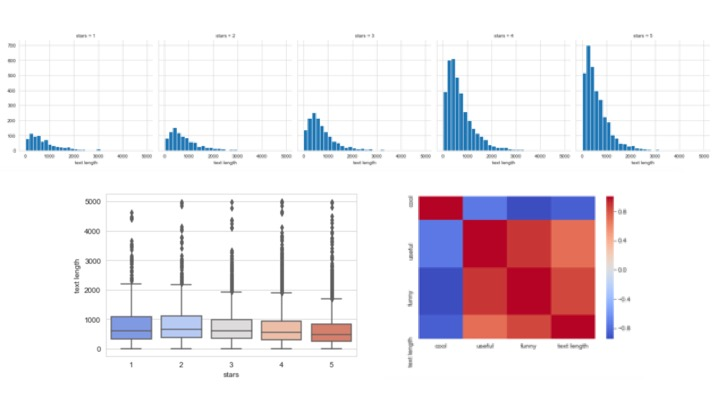

## Projects

### Production Cost Optimization  - Descriptive and Predictive Analysis with Python

**[View Complete Project on Github](https://github.com/echozhong1202/Portfolio/blob/master/Aurubis%20Yield%20Prediction%20Project_v2.ipynb)**

> Our client is a manufacturing operation that produces copper and brass strip for use in diverse industries. Our client collects data from all of its processes, both manufacturing and administrative. Data is stored on several platforms throughout the organization including Oracle, SQL Server and DB2. For this project, our goal is to help the client predict yield and improve yield.

> "Yield" quantifies the percentage of a product's cast (starting) weight that is converted into a finished product to be shipped to the customer. Improving yield, along with improving the accuracy of predicted (or "standard") yield, has a positive impact on scheduling efficiency, customer on-time delivery performance as well as the potential to lower production cost and inventory in the plant.

> For this project, we conducted descriptive statistics on yield patterns and trends across products, starting widths, operations/production pathover time. We also ran predictive analysis that allow client to predict yield by alloy and cast width combination, as well as other main drivers for predicting yield. 

---
### Exploring Canada Bankruptcies and Proposals in 2014 - Data Visualization with Tableau

**[View in Tableau Public]
(https://public.tableau.com/profile/yuqiao.zhong#!/vizhome/CanadaInsolvencies_15895158997600/Dashboard?publish=yes)**

---

### Is Coronavirus Outbreak Under Control Now? - Data Visualization with Tableau

**[View in Tableau Public](https://public.tableau.com/profile/yuqiao.zhong#!/vizhome/Covid19Analysis_15895058979080/Dashboard1?publish=yes)**

> Recently, the first thing most of us do in the morning is to check the news on coronavirus that originated in Wuhan, China. It's been a month, but coronavirus is still spreading,  people are dying, and doctors are fighting at the frontline. We all wonder if things are getting better now. 

> Inspired by Micheal (Sifeng) Zhu's informational Tableau workbook on coronavirus, I extracted data from National Health Committee and worked on a Tableau dashboard that answers the question 'Is coronavirus outbreak under control?' in 4 perspectives. 

---

### New Product Launch Recommendation for EarlyRiders (Toyhorse Manufacture) - Conjoint Analysis and Market Simulation with R

**[View Project Summary PDF on Github](https://github.com/echozhong1202/Portfolio/blob/master/Case%203%20Report%20-%20team%2024%20(1).pdf)**

**[View Complete Project in R on Github](https://github.com/echozhong1202/Portfolio/blob/master/Analyze-Toy-Horse-Conjoint-Experiment-with-R.html)**

> For this academic project, we conducted a conjoint analysis for a relatively small toy company, EarlyRiders, that specializes in the manufacture of quality toy riding horses with a particular focus on natural materials.
EarlyRiders had a recent management change and realized that their product set was underperforming. They currently offer two products and one in particular was not doing well. The management team decided after much deliberation to revitalize their product portfolio based on the opinions of potential end-users. For this purpose, the company ran a conjoint analysis and our team analyzed the data and created a presentation to give recommendation on what products to launch next.

---

### Credit Risk Prediction Model and Interactive Interface - Predictive Analysis with Python

**[View Complete Project on Github](https://github.com/echozhong1202/Portfolio/blob/master/Credit%20Risk%20Prediction%20Model%20and%20Interactive%20Interface.ipynb)**

> Our goal for this project is to develop a predictive model and a decision support system (DSS) that evaluates the risk of Home Equity Line of Credit (HELOC) applications. Ultimately, the decision support system, which is essentially an interactive interface, is able to give understandable explanations for sales representatives in a bank/credit card company. Even without coding experience, they can easily use the system to decide on accepting or rejecting applications.

---

### Udemy: Lending.com Applicant Trustworthiness Analysis - Exploratory Data Analysis with Python

**[View Complete Project on Github](https://github.com/echozhong1202/Portfolio/blob/master/Lending.com%20Applicant%20Trustworthiness%20Analysis%20-%20Exploratory%20Data%20Analysis%20using%20Python.ipynb)**

> Lending Club connects people who need money (borrowers) with people who have money (investors). Here we will use Python with some packages like Pandas, Matplotlib and seaborn to analyze a dataset that was collected on lending.com over 2007-2010. The dataset contains data on more than 9000 borrowers and borrowers' features like income, FICO, interest rate, etc.

> We will analyze this data to get insights on the main difference between fully paid borrowers and not fully paid borrowers. These insights might also be used by people in landing.com to better predict whether the borrower will pay in full or not

---

### Kaggle: Classify Yelp Reviews with Natural Language Processing using Python 

**[View Complete Project on Github](https://github.com/echozhong1202/profolio/blob/master/Classify%20Yelp%20Reviews%20into%201%20star%20and%205%20star%20-%20Natural%20Language%20Processing%20using%20Python.ipynb)**

> My ultimate goal for this project is to predict whether a Yelp review is 1 star or 5 star based on the text content. I took a machine learning course taught by Jose Portilla on Udemy. And now I want to apply what I learned into a new project.

> The yelp review dataset is obtained from Kaggle dataset (https://www.kaggle.com/c/yelp-recsys-2013Each). Each observation in this dataset is a review of a particular business by a particular user. 

> The NLP process in this project is basic. This project is more about understanding NLP at a higher level.

---

Page template forked from <a href="https://github.com/evanca/quick-portfolio">evanca</a>

<!-- Remove above link if you don't want to attibute -->
